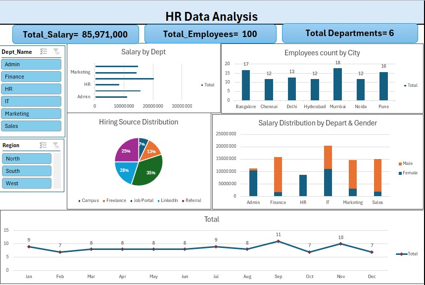

# 📊 HR Data Analysis Dashboard (Excel)

## 📌 Project Overview

This project showcases an interactive **HR Data Analysis Dashboard** developed using **Microsoft Excel**. The dashboard transforms raw HR data into meaningful insights through interactive visualizations, KPI cards, Pivot Tables, Pivot Charts, and Slicers.

It enables users to analyze employee distribution, salary trends, hiring sources, department-wise performance, and monthly employee data.

---

## 🖼 Dashboard Preview

---
## 📈 Key KPIs

- 👥 Total Employees: **100**
- 💰 Total Salary: **85,971,000**
- 🏢 Total Departments: **6**

---

## ✨ Dashboard Features

- Department-wise Salary Analysis
- Employee Count by City
- Hiring Source Distribution
- Salary Distribution by Department & Gender
- Monthly Employee Trend
- Interactive Department Filter
- Interactive Region Filter

---

## 🛠 Tools & Techniques Used

- Microsoft Excel
- Pivot Tables
- Pivot Charts
- Slicers
- KPI Cards
- Data Cleaning
- Dashboard Design

---

## 💡 Skills Demonstrated

- Data Cleaning
- Data Analysis
- Dashboard Design
- HR Analytics
- Interactive Reporting
- Data Visualization
- Excel Dashboard Development

---

## 📂 Project Files

| File | Description |
|------|-------------|
| HR_Data_Analysis_Dashboard.xlsx | Interactive Excel Dashboard |
| HR_Dashboard.jpg | Dashboard Preview |
| README.md | Project Documentation |

---

## 📊 Key Insights

- IT department records the highest salary expenditure.
- Mumbai has the highest number of employees.
- Job Portal contributes the largest share of employee hiring.
- Interactive slicers allow users to filter data by department and region.
- KPI cards provide a quick overview of key HR metrics.

---

## 🎯 Learning Outcomes

This project helped me practice:

- Building interactive Excel dashboards
- Working with Pivot Tables and Pivot Charts
- Creating KPI Cards
- Using Slicers for dynamic filtering
- Designing business reports
- Presenting HR insights through visualizations

---

## 👩‍💻 Author

**Bhoomika Jakhar**

Aspiring Data Analyst

**Skills:** Excel • SQL • Power BI

---

⭐ If you found this project helpful, feel free to star this repository.
